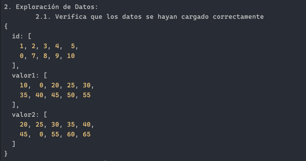
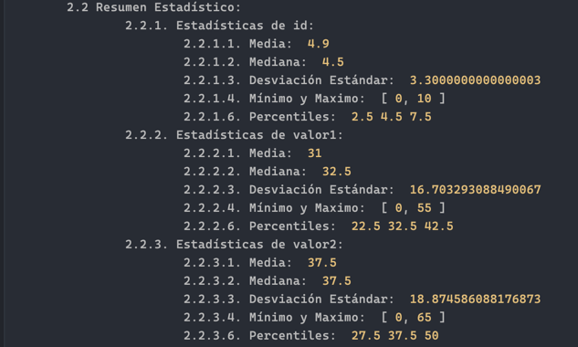
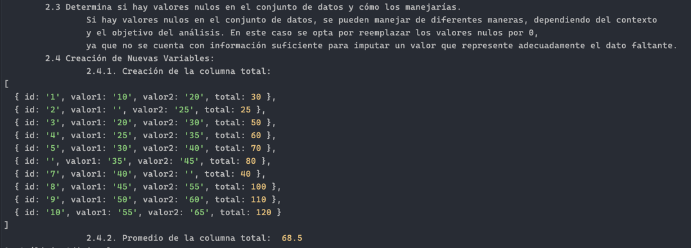
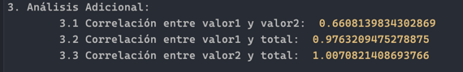

# Prueba tecnica Fabio Flores
## Prerequisitos para ejecutar el proyecto

Tener instalado node.js, se puede descargar acá [Node.js](https://nodejs.org/en)

## Instalar dependencias

Una vez instalado node.js ejecutar el siguiente comando en la terminal

```bash
npm install
```

## Ejecutar el proyecto

Para ejecutar el proyecto se debe ejecutar el siguiente comando en la terminal

```bash
npm run start
```

El proyecto desplegará en consola las respuesta

## Respuestas 

En caso de tener problemas a correr el proyecto estas son mis respuestas

### Cargar el archivo y mostrar el contenido


### Resumen estadistico 


### Pregunta datos nulos y creación columna total y su media


### Analisis adicional
